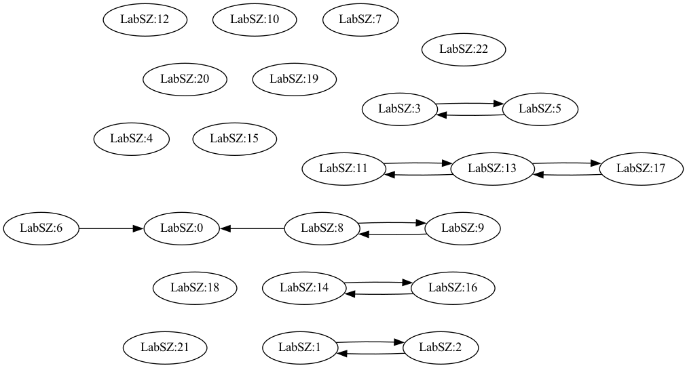

# Logdag tutorial

This tutorial demonstrates causal analysis from log data using log2seq, amulog, and logdag.
The tutorial uses small sample log data (SSH_2k.log) from [loghub](https://github.com/logpai/loghub).

## Prepare log2seq parser

Basically, log message format depends on the dataset.
We first need to prepare log2seq parser script for message parsing.
The script will be used in amulog.
If the target log data is standard Linux syslog, you can skip this step.

The parser script for loghub logs are provided in [example directory of log2seq](https://github.com/amulog/log2seq/tree/master/example).

## Generate amulog DB

Generating amulog DB consists of multiple tasks of log preprocessing:
1. Parse information from log messages (e.g., Timestamp, Hostname)
2. Segment (tokenize) words of free-format message part (statement ppart) in log messages.
3. Generate log templates (i.e., log parsing) automatically with some algorithm.
4. Classify log messages with the templates.
5. Store the information and classification into DB.
(1 and 2 correspond to log2seq.)

These tasks can be easily done with the following one command.
This command use an amulog config file `ssh_amulog.conf`.
The config file specifies `ssh_parser.py` as log2seq script and `drain` as template generation algorithm.
```
> amulog db-make -c ssh_amulog.conf
```

The stored information can be searched and shown via command line.
Subcommand `show-db-info` shows abstracted information of the amulog DB.
The results mean there are 2,000 log lines from 6:55 to 11:04 on 10 Dec
(year is added externally in log2seq parser script).
The log lines are classified into 23 clusters corresponding to the generated log templates.
```
> amulog show-db-info -c ssh_amulog.conf
[DB status]
Registered log lines : 2000
Term : 2022-12-10 06:55:46+09:00 - 2022-12-10 11:04:45+09:00
Log templates : 23
Log template groups : 23
Hosts : 1
```

Subcommand `show-lt` shows the list of all generated log templates.
The line includes Log template ID (ltid), generated template, and the number of instances (classified messages). 
```
> amulog show-lt -c ssh_amulog.conf
0 reverse mapping checking getaddrinfo for ** [**] failed - POSSIBLE BREAK-IN ATTEMPT! (85)
1 Invalid user ** from ** (113)
2 input_userauth_request: invalid user ** [preauth] (113)
...
```

Subcommand `show-log` searches the log messages.
In this example, amulog searches log messages classified with a log template of LTID 1.
```
> amulog show-log -c ssh_amulog.conf ltid=1
2022-12-10 06:55:46+09:00 LabSZ Invalid user webmaster from 173.234.31.186
2022-12-10 07:07:38+09:00 LabSZ Invalid user test9 from 52.80.34.196
2022-12-10 07:08:28+09:00 LabSZ Invalid user webmaster from 173.234.31.186
...
```

## Causal analysis

Logdag estimates causal DAGs from time-series in amulog DB.
It requires a logdag config file (`ssh_logdag.conf` in this tutorial) which is a different file from amulog configuration.
A logdag config file specify corresponding amulog config file in the option `database_amulog.source_conf`.

The causal analysis has two steps:
1. Generate preprocessed time-series from amulog DB.
2. Apply causal discovery.
These two commands correspond to the two steps.
```
> python -m logdag.source make-evdb-log-all -c ssh_logdag.conf
> python -m logdag make-dag -c ssh_logdag.conf
```

In the sample configuration, logdag apply day-by-day analysis
(1-day-long time-series as input)
and a node correspond to a set of log messages
with same log template and same source hostname.

Subcommand `show-list` shows the abstracted results.
It means there are 23 time-series nodes and 14 found causal edges on Dec 10.
```
> logdag show-list -c ssh_logdag.conf
all_20221210 23 14
```

Subcommand `plot-dag` generates a visualized graph.
The graph file format depends on the specified file extension.
Option `-f no_isolated` will omit nodes without any adjacent edges.
```
> logdag plot-dag -c ssh_logdag.conf -o output.png all_20221210
> logdag plot-dag -c ssh_logdag.conf -o output2.pdf -f no_isolated all_20221210
```



Subcommand `show-subgraphs` shows causal edges and their subgraphs in text format.
With option `--detail`, you can also check representative log messages of the time-series nodes.
```
logdag show-subgraphs -c ssh_logdag.conf all_20221210
Subgraph 0 (4 nodes)
8@LabSZ:8 -> 0@LabSZ:0
8@LabSZ:8 <-> 9@LabSZ:9
6@LabSZ:6 -> 0@LabSZ:0
...
```
